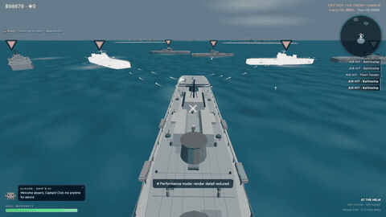
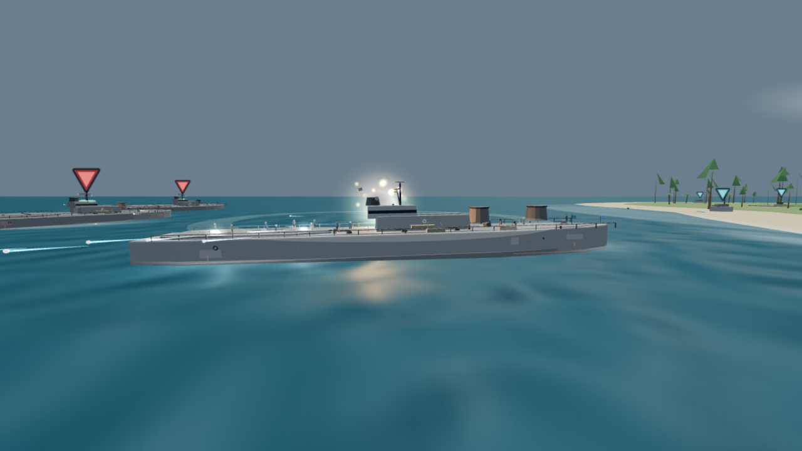
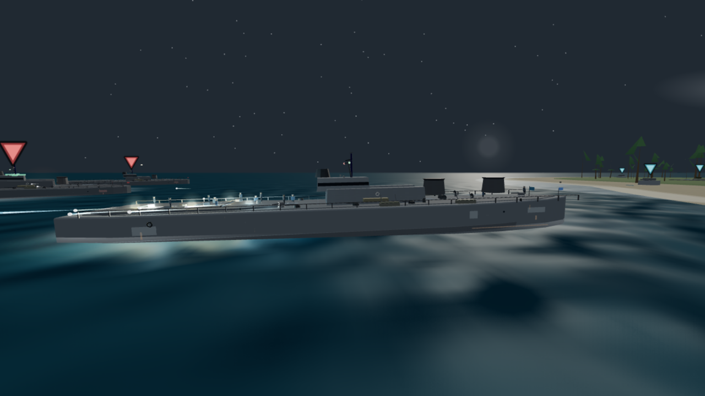
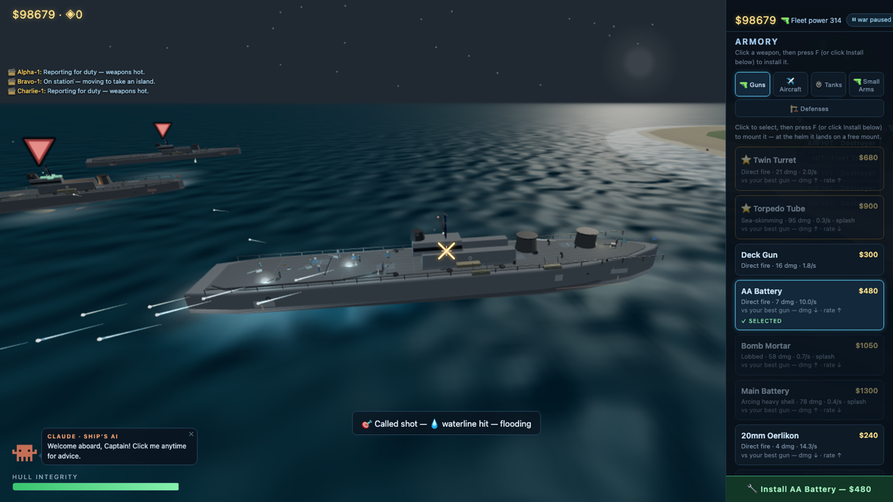

<div align="center">

# Iron Tide ⚓

**你是舰长，站在自己军舰的甲板上。**
买炮装炮、掌舵冲锋、起飞舰载机、开坦克登岛、上岸端着枪打——目标是摧毁敌方海港。

### ▶ [点这里直接玩](https://game.boobank.com/irontide/) — 免费、免注册、免安装，浏览器里几秒钟就开打

*A free browser naval-action game. No account, no ads, no install — [play it here](https://game.boobank.com/irontide/).*



</div>

---

## 玩

**在线试玩：https://game.boobank.com/irontide/**

或者把仓库下下来，在浏览器里打开 `index.html` 就行，不需要任何构建步骤。手机、平板、手柄都能玩，也能"添加到主屏幕"当 App 用（PWA，断网也能开战）。

| | |
|---|---|
| 🚢 **舰上作战** | W/S 油门 · A/D 舵 · 鼠标瞄准 · 左键开火 |
| ✈️ **舰载机** | P 起飞/跳伞，Y 让 AI 飞行员开走一架 |
| 🛞 **坦克** | E 上车、G 切水陆两栖，直接从甲板开上滩头 |
| 🥾 **徒步** | G 上岸，端着枪清掉碉堡 |
| 🔧 **甲板组装** | Tab 开军械库买炮 → F 装到自己甲板上 → E 亲自操炮 |

---

## 这个游戏是什么



**原作者：[VideoGameTips](https://github.com/VideoGameTips/irontide)** —— 29 艘可选战舰、61 种飞机、22 种坦克、31 关战役、会自己买武器升级的 AI 舰队、损管与天气系统，全部装在一个 HTML 文件里。

- **29 艘可选战舰**，从护卫舰到超无畏舰，还有大和、武藏、俾斯麦、密苏里、企业号、胡德号、致远、定远、辽宁这些历史名舰
- **31 个战区的世界战役**，尽头站着宿敌瓦尔加大元帅（Grand Marshal Varga）——他会在电台里跟你说话
- **一场战斗里四种打法无缝切换**：军舰、飞机、坦克、步兵
- **12 枚勋章 + 每个战区三星评价 + 家庭高分榜**
- **快速战斗**和 **7 张沙盒地图**，想打一架就打一架
- 动态天气 + 每个战区各自不同的程序化配乐；L 键拍照模式
- 中英双语随时切换



---

## 这个 fork 改了什么

这个 fork 只做一件事：**让第一次打开游戏的小朋友也能马上玩得开心。**

| | |
|---|---|
| 🌏 **中英双语** | 菜单右上角 🌐 一键切换，游戏中途也能切 |
| ⭐ **爽感开局** | 开局就在舵位上、船上预装 2–3 门会自动开火的炮。只按住 W，一分钟左右就能击沉第一艘敌舰 |
| 📖 **分步教学** | 屏幕中央一次只教一句，达成条件自动推进，Esc 可跳过 |
| ⏸ **菜单即暂停** | 打开商店/海港/建造/地图/聊天时战斗冻结，慢慢读不会被击沉 |
| 🎚 **难度选择** | 🙂简单 / 😐普通 / 😈困难，新手默认简单（伤害减半、船体 +50%） |
| 🛒 **商店分类** | 121 个物品分成 5 个页签，⭐ 标出新手推荐，贵重装备默认折叠 |
| 🎖 **成就体系** | 12 枚勋章、战区三星评价、结算战报卡片可存成 PNG |
| ⚙️ **设置** | 音量滑块、精简 HUD、家长模式（关闭核武与神风内容） |
| 💾 **战局存档** | 每 30 秒自动存，菜单上「▶ 继续上次战局」一键回到战场 |
| 📱 **触屏支持** | iPad / 手机上用虚拟摇杆和情境按钮玩 |
| 📲 **可安装 (PWA)** | 加到主屏幕当 App 玩，断网也能开战 |
| 🎮 **手柄支持** | 左摇杆开船 · 右摇杆视角 · 扳机开火 |
| 🎨 **无障碍** | 小地图友军圆点、敌军菱形，不只靠红蓝区分 |



另外修了几个 bug，其中最有意思的一个：`buildLand()` 结尾的 `u[kind]=true` 把坦克的数据对象覆盖成了布尔值，导致**所有玩家坦克的血量是 `NaN`、永远打不死**。

---

## 结构

```
index.html        整个游戏（唯一正本，无构建步骤）
vendor/three.js   本地 three.js r128，断网也能开
js/terrain.js     抽出来的纯几何函数（岛屿地形高度）
tests/            node:test 单测 + Playwright 冒烟测试（npm test）
tools/            推广物料生产工具（截图/视频/门户构建包，见下）
server/           可选的 WebSocket 中继服务器（多人游戏用，实验性）
docs/             设计文档（DIRECTION.md：穿透/打击感/组装/成就/故事的方向规划）
promo/            推广渠道执行手册与物料（见 promo/README.md）
```

### 推广物料工具

```bash
npm install                            # 需要 @playwright/test
node tools/capture-screenshots.js      # 从线上站点抓一组宣传截图
node tools/capture-hero-video.js       # 录 45 秒 hero 视频（运镜脚本化）
node tools/build-portal.js             # 生成 itch.io / 门户两个发行 zip
node tools/verify-portal-build.js      # 在 iframe 里实测两个 zip（10 项检查）
```

门户版 zip 会自动去掉 service worker 注册（第三方 iframe 源下会失败）并隐藏联机入口（CrazyGames 对联机游戏有额外 UX 要求，按单机提交）。

---

## 给原作者的话

改进建议都提在了[原仓库的 issue](https://github.com/VideoGameTips/irontide/issues) 里，每条都附了这里对应的实现作为参考。这个游戏是你的，怎么改由你决定。

---

<div align="center">

**[▶ 开打](https://game.boobank.com/irontide/)**

</div>
